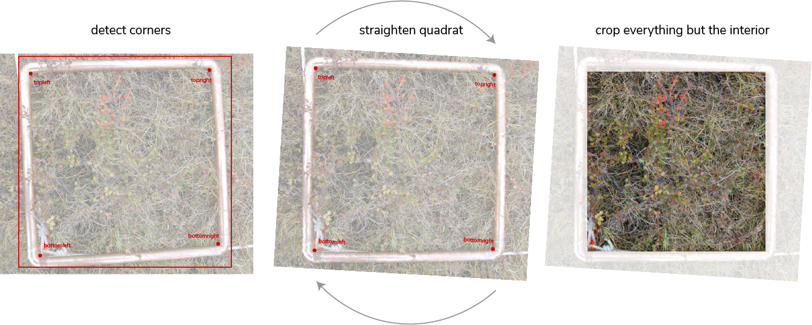

# Implementation

Adopted from ml-morph.

Use this tool to detect corners of the veg quadrats, rotate the image based on those detections to straighten the image, and crop to the inside of the quadrat. Currently increasing model accuracy by annotating additional images.

<p float="center">
  
</p>


## Process

1. copy all images into ```img_small/```

2. resize images according to specified factor (width/n), and rotate all portrait images. <br>
`python3 src/image-resize.py -i img_small -n 5`

3. split the image data into train/test <br>
`python3 src/preprocessing.py -i img_small`

4. create training xml <br>
`imglab -c train.xml train`

5. create test xml <br>
`imglab -c test.xml test`

6. Annotate training and test sets <br>
`imglab --parts 'tl tr br bl' train.xml` <br>
`imglab --parts 'tl tr br bl' test.xml` <br>
 * draw bounding box
 * select bounding box
 * right click within bounding box and choose appropriate landmark

7. Train the detector <br>
`python3 src/detector_trainer.py -d train.xml -t test.xml -n 7 -w 79000 -e 0.001 -c 15`

8. Train for the prediction of corner locations.
`python3 src/shape_trainer.py`

9. Predict on images outside of training set. <br>
`python3 src/prediction.py -i test -d detector.svm -p predictor.dat `

10. View results <br>
`imglab output.xml`

